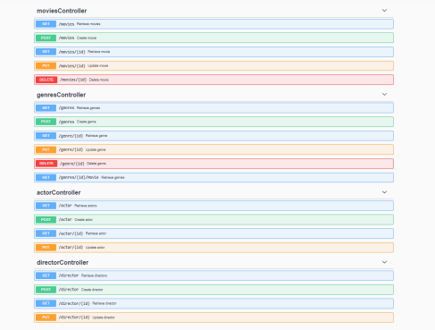
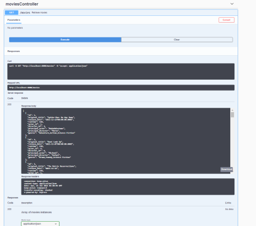
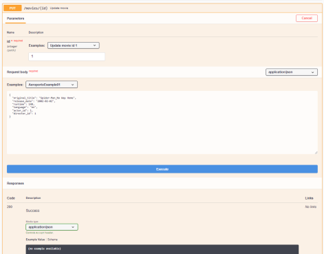

# Parte 2 - Desenvolvimento Web I

Neste repositório está o projeto desenvolvido para a disciplina 'Desenvolvimento Web I', uma disciplina de segundo ano do curso de informática da Universidade da Maia. Desenvolvido pelo Grupo _01_: [@AnaAzevedo](https://github.com/AnaAzevedo2), [@MarianaLopes](https://github.com/marlope02), [@MarioRodrigues](https://github.com/MarioRodrigues2304).

## Tema 

Este trabalho tem como âmbito o desenho e criação de um serviço web que relaciona recursos. Tais recursos como 'Movies', 'Genres', 'Actor' e 'Director'.   

## Organização do repositório 

_O repositório está organizado da seguite maneira:_
* **Código Fonte** está na pasta [src](src/).
* Capítulos do relatório estão na pasta [doc](doc/).
* [Documento OpenAPI](src/api/openapi.yaml) inicial.
* [Documento MYSQL](Queries_base_de_dados.sql) para criação da Base de Dados.
* [Documento Docker-compose](src/docker-compose.yml) para puxar as imagens dos repositórios DockerHub e montar a aplicação.

 

* **Docker** - https://hub.docker.com/u/inf21dw1g01

 

## Galeria 

|            |   |
| ---------------------------- | ----------- |
|                 | 

## Tecnologias 

_As tecnologias usadas neste projeto, foram as seguites:_
* Javascript
* NodeJS
* MySQL
* OpenAPI

### Frameworks e Livrarias 

* Docker
* NodeJS

## Relatório
_Estão adicionados um documento por capítulo_

### Apresentação da API
* Capítulo 1:[Apresentação da API](doc/c1.md)
### Recursos
* Capítulo 2:[Recursos](doc/c2.md)
### Produto
* Capítulo 3:[Produto](doc/c3.md)

 

## Grupo _01_
* Ana Filipa Azevedo [@AnaAzevedo](https://github.com/AnaAzevedo2) 
* Mariana Lopes [@MarianaLopes](https://github.com/marlope02) 
* Mário Rodrigues [@MarioRodrigues](https://github.com/MarioRodrigues2304)
