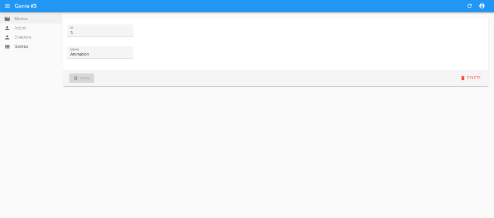

# C4 : Apresentação

## Introdução
_Esta API tem como âmbito o desenho e criação de um serviço web que permite a consulta de informação de filmes._
_Para além da consulta de filmes também é possível ver a lista dos gêneros, users e a lista de filmes de cada user._

## Recursos 
_Foram usados 9 recursos:_
* FilmesController
* ...

_Em cada recurso estão implementados os verbos (métodos) do protocolo HTTP._

#### Recurso - PingController
| Métodos                      | Caminho   | Resultado    |
| ---------------------------- | ----------- | -----------  |
| GET | /ping               |        |

#### Recurso - UserController
| Métodos                      | Caminho   | Resultado    |
| ---------------------------- | ----------- | -----------  |
| GET | /users/count               |        |

## Postman
_Criação de uma 'Collection' no Postman que se encontra no [src folder](src/)._

## Docker

## Loopback4 
A API está separada entre várias camadas no LoopBack:

* Os **controladores** representam os endpoints da nossa API. Esses endpoints terão que autenticar solicitações recebidas, analisar e validar, bem como orquestrar chamadas para Serviços e Repositórios.
* Os **serviços** fornecem interfaces comuns para APIs e serviços externos. Isso permite invocar serviços externos sem mencionar detalhes de conexão todas as vezes. Os serviços também fornecem interfaces comuns para classes disponíveis localmente.
* **Modelos** e **Relações** representam objetos de domínio e fornecem modelos de relacionamento de entidade.
* Os **repositórios** representam a camada Entity para um modelo específico e tratam de todas as operações CRUD no modelo. Eles também usam repositório de outros modelos para lidar com relações de entidade.

## React Admin
_O React Admin é uma framework frontend que usa as nossas API's REST já existentes, permitindo assim criar aplicações frontend mais facilmente que interagem com a backend numa maneira standarizada através de data providers._

## ERROS 

## Conclusão
Com este trabalho conseguimos desenvolver a matéria lecionada na cadeira de Desenvolvimento Web I, aplicando a mesma num trabalho prático de desenvolvimento de uma aplicação e serviços web, usando GET's, POST's, DELETE's, PUT's e PATCH's nos recursos do trabalho. O maior problema encontrado na realização do trabalho foi a utilização do Docker acrescentando ainda que o loopback está terminado porém não funciona e que o React Admina está incompleto.

---  
[< Previous](c3.md) | [^ Main](../../../) | Next >
:--- | :---: | ---: 
